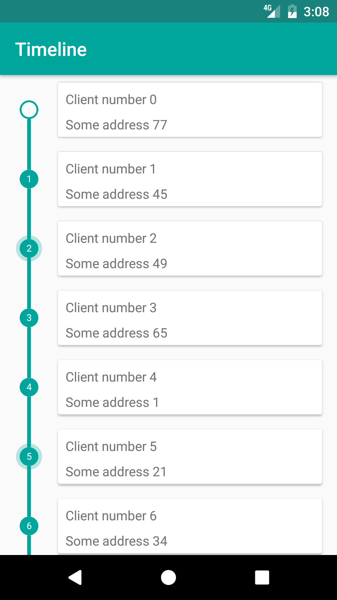
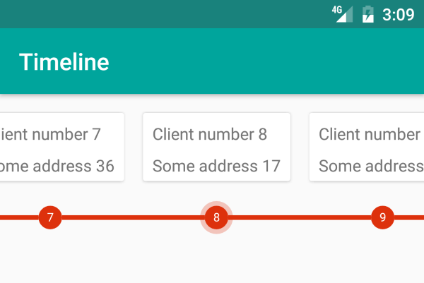

# TimelineView

Library used to mark timeline items in list. It can be used for processes that take multiple steps like tracking online orders.
Support for both horizontal and vertical lists and a lot of customization options as shown in example below:

```xml
    <com.repsly.library.timelineview.TimelineView
        android:id="@+id/timeline"
        android:layout_width="wrap_content"
        android:layout_height="match_parent"
        app:lineColor="@color/colorPrimary"
        app:lineOrientation="vertical"
        app:lineSize="4dp"
        app:markerActive="false"
        app:markerActiveColor="@color/colorActiveItem"
        app:markerActiveStrokeWidth="8dp"
        app:markerColor="@color/colorPrimary"
        app:markerSize="20dp"
        app:markerStrokeWidth="2dp"
        app:markerTextColor="@android:color/white"
        app:markerTextSize="10sp"/>
```

For more examples check sample app.

Screens
--------



Installation
--------
Add jitpack to root gradle
```
allprojects {
	repositories {
		...
		maven { url 'https://jitpack.io' }
	}
}
```

Add the dependency
```
compile 'com.github.repsly:TimelineView:v1.2'
```
